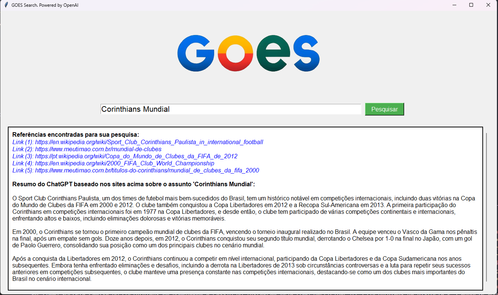

# GOES-AI-Search


## Descrição do Projeto
O GOES Search Assistant é uma aplicação desenvolvida em Python que permite ao usuário realizar pesquisas no Google e obter resumos concisos dos resultados. A aplicação utiliza a API de Pesquisa Personalizada do Google para buscar os top 5 resultados de uma consulta, realiza web scraping para extrair o conteúdo relevante dessas páginas, e envia o conteúdo para o ChatGPT para gerar um resumo. O projeto combina conceitos de APIs, web scraping e processamento de linguagem natural para proporcionar uma experiência de pesquisa aprimorada.

## Funcionalidades
- Interface gráfica para entrada de texto e exibição de resultados.
- Pesquisa no Google usando a API de Pesquisa Personalizada.
- Coleta e armazenamento de conteúdo HTML dos top 5 URLs.
- Envio do conteúdo coletado para o ChatGPT para geração de um resumo.

## Tecnologias Utilizadas
- **Linguagem de Programação**: Python
- **Bibliotecas**:
  - `tkinter`: Para criação da interface gráfica.
  - `requests`: Para fazer requisições HTTP.
  - `BeautifulSoup`: Para web scraping.
  - `openai`: Para interação com a API do ChatGPT.
- **APIs**:
  - Google Custom Search API: Para realizar buscas no Google.
  - OpenAI API: Para enviar o conteúdo HTML e receber um resumo.

## Estrutura do Projeto
- `GOES_API_google.py`: Módulo que lida com a pesquisa no Google e coleta de URLs.
- `GOES_API_gpt.py`: Módulo que lida com a interação com a API do ChatGPT.
- `GOES_front.py`: Módulo que cria a interface gráfica e gerencia a interação do usuário.
- `GOES_Web_Scraper.py`: Módulo que realiza o web scraping dos URLs coletados.

## Detalhes da Implementação

### GOES_API_google.py
Este módulo lida com a pesquisa no Google e a coleta de URLs. Ele utiliza a API de Pesquisa Personalizada do Google para buscar os top 5 resultados para uma consulta fornecida pelo usuário. Os resultados são exibidos na interface gráfica, e os links são armazenados para posterior web scraping.

### GOES_API_gpt.py
Este módulo lida com a interação com a API do ChatGPT. Ele lê o conteúdo HTML coletado, limpa o texto removendo caracteres especiais e espaços em branco desnecessários, e envia o conteúdo para o ChatGPT para gerar um resumo. O resumo é então exibido na interface gráfica.

### GOES_front.py
Este módulo cria a interface gráfica usando `tkinter`. Ele inclui uma barra de pesquisa, um botão para iniciar a pesquisa, e uma área de texto para exibir os resultados e o resumo gerado pelo ChatGPT. A interface é configurada para ser intuitiva e fácil de usar.

### GOES_Web_Scraper.py
Este módulo realiza o web scraping dos URLs coletados. Utilizando a biblioteca `BeautifulSoup`, ele extrai os elementos HTML relevantes (títulos, cabeçalhos, parágrafos) e salva o conteúdo em um arquivo de texto. Esse arquivo é então enviado para o ChatGPT para processamento.

## Instruções de Uso
1. **Instale as dependências**:
   - Certifique-se de ter Python instalado em sua máquina.
   - Instale as bibliotecas necessárias

2. **Obtenha as chaves de API**:
   - **Google Custom Search API**: Crie um projeto no Google Cloud Platform e obtenha uma chave de API.
   - **OpenAI API**: Crie uma conta no OpenAI e obtenha uma chave de API.

3. **Configure as chaves de API**:
   - Substitua as variáveis `api_key` e `cse_id` no arquivo `GOES_front.py` pelas suas chaves de API do Google.
   - Substitua a variável `openai.api_key` no arquivo `GOES_API_gpt.py` pela sua chave de API do OpenAI.

4. **Execute a aplicação**:
   - No terminal, navegue até o diretório do projeto e execute:
     ```bash
     python GOES_front.py
     ```

5. **Utilize a interface**:
   - Digite um termo de pesquisa na barra de entrada e clique em "Pesquisar".
   - O aplicativo exibirá os top 5 resultados da pesquisa do Google, coletará o conteúdo HTML dessas páginas e enviará para o ChatGPT para gerar um resumo.
   - O resumo será exibido na área de texto da interface.

## Melhorias ou Próximos Passos

Atualmente, consumir a API do ChatGPT tem um custo associado, o que pode limitar a escalabilidade do projeto GOES AI Search. Para mitigar esses custos e tornar a aplicação mais sustentável a longo prazo, estou estudando mais sobre machine learning e inteligência artificial com o objetivo de implementar uma IA local. Isso permitirá que eu utilize uma IA própria para gerar os resumos dos conteúdos HTML, eliminando a necessidade de usar serviços pagos.

Estou considerando algumas opções de IA open source que podem ser integradas ao projeto. Entre elas estão o **GPT-J**, um modelo de linguagem natural desenvolvido pela EleutherAI que é uma alternativa poderosa e gratuita ao GPT-3; o **BERT**, uma técnica de machine learning desenvolvida pelo Google para o processamento de linguagem natural; e o **T5 (Text-to-Text Transfer Transformer)**, um modelo da Google Research treinado para transformar diversas tarefas de NLP em uma tarefa de tradução de texto. Com uma dessas soluções, o GOES AI Search poderá fornecer resumos de maneira mais eficiente e sem custos adicionais, melhorando a viabilidade do projeto a longo prazo.


## Contribuidores
- Mateus Curtolo de Goes
